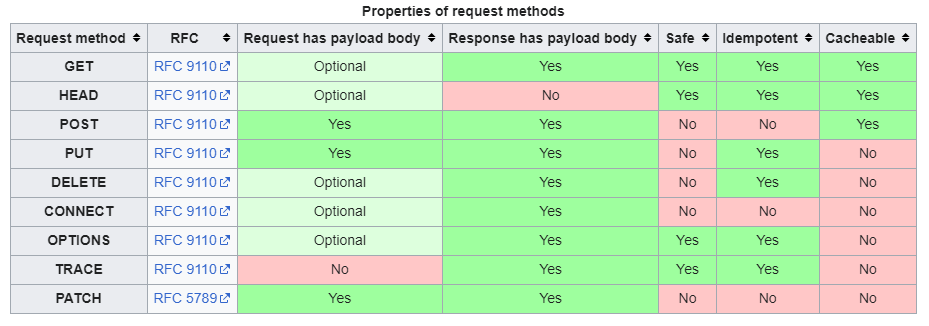

<!-- HEADER -->
<div align="center">
  <h1 align="center">HTTP Method</h1>
</div>

# HTTP API

## API URI Consideration
```
1. Identify the resource
2. Apply the URI layer structure
```
> Search Customer List /customers
> 
> Search customer /customers/{id}
> 
> Register customer /customers/{id}
> 
> Modify customer /customers/{id}
> 
> Delete customer /customers/{id}
> 
> ** How to segregate each one of them? **
> 
> => URI just identifies the resource (customer)

> Resource: customer
> 
> Action: search, register, delete, modify

## HTTP Methods
1. GET: Search resource
2. POST: Process the requested data, used in registration
3. PUT: Substitute the resource, create the resource if not found
4. PATCH: Modify part of resource
5. DELETE: Delete the resource
6. HEAD: Similar to GET method. Except the message part

### GET
```shell
GET /search?q=hello&hl=ko HTTP/1.1
Host: www.google.com

* Search the resource
* Data is transported thru the query
```
```shell
(1) Request
GET /customers/123 HTTP/1.1
Host: localhost:8080
```
```shell
(2) Receive data from the server
/customers/123
{
  "username": "alvin",
  "age": 20
}
```
```shell
(3) Response
HTTP/1.1 200 OK
Content-Type: application/json
Content-Length: 35

{
  "username": "alvin",
  "age": 20
}
```

### POST
```shell
POST /customers HTTP/1.1
Content-Type: application/json

{
  "username": "kim",
  "age": 30
}

* Transport request data thru message body
* Server processes the requested data
* Register the new resource, process the process
```
```shell
(1) Transport the message
POST /customers HTTP/1.1
Content-Type: application/json

{
  "username": "kim",
  "age": 30
}
```
```shell
(2) Create a new resource (server)
/customers/123
{
  "username": "kim",
  "age": 30
}
```
```shell
(3) Response data
HTTP/1.1 201 Created
Content-Type: application/json
Content-Length: 35
Location: /customers/123

{
  "username": "kim",
  "age": 30
}
```
#### How to process the requested data?
```
<specification>

The POST method submits an entity to the specified resource, often causing a change in state or side effects on the server
```
```
<examples>

1. Provide a data block, such as a field filled out on the HTML form, to the data process mechanism. (Registration, order)
2. Post a message to a bulletin board, blog, etc,. (Create a comment line)
3. A new resource that the server not identified yet. (Create a new order)
4. Add a resource to an existing resource (Add words to the end of the document)
```

### PUT
```
<specification>

The PUT method replaces all current representations of the target resource with the request payload
```
```
The client identifies the resource, then designates URI
```
```shell
(1) Client - request
PUT /customers/123 HTTP/1.1
Content-Type: application/json

{
  "username": "hahee",
  "age": 30
}
```
```shell
(2) The resource is substituted (If there's no resource, then create one)
/customers/123

{
  "username": "hahee",
  "age": 30
}
```

### PATCH
```
<specification>

The PATCH method makes partial changes to an existing resource
```
```shell
(1) Usage
PATCH /customers/123 HTTP/1.1
Content-Type: application/json

{
  "age": 20
}
```

### DELETE
```
<specification>

The DELETE method deletes the specified resource
```
```shell
(1) Usage
DELETE /customers/123 HTTP/1.1
Host: localhost:8080
```

## HTTP method property
* Safe Methods
* Idempotent Methods
* Cacheable Methods



```
Safe: Does not change the resource even if the method is called

Idempotent: The result is all the same with the iterative calls
> GET: the same result
> PUT: Replace the result, which results in the same result
> DELETE: Delete the result, which results in the same deleted result
> POST: NOT A IDEMPOTENT

Cacheable: GET / HEAD / POST / PATCH
> In a real world, GET is mostly used to cache the request result
> POST, PATCH: it is hard to implement that considering the body message as a cache key
```