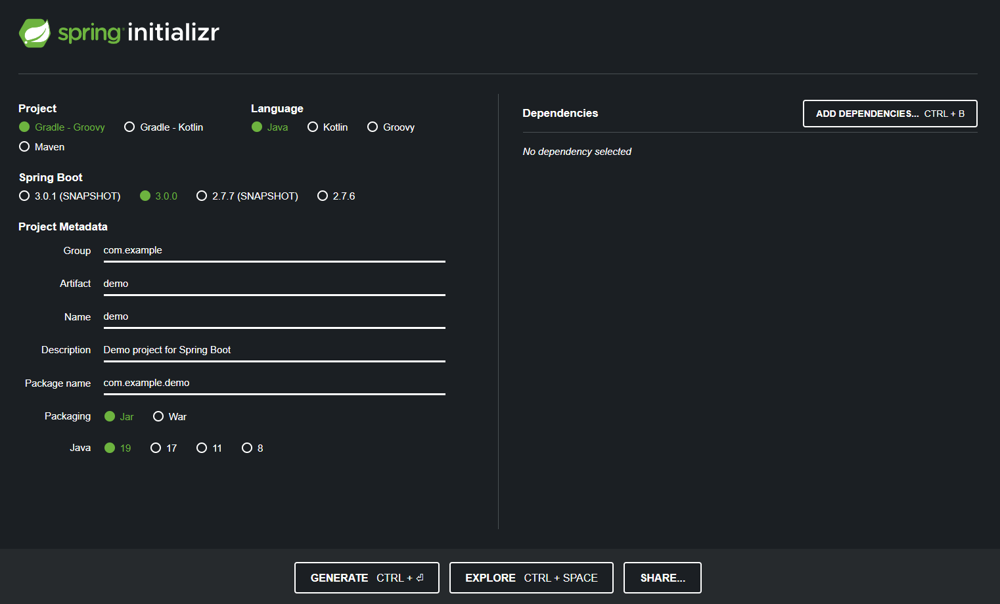

<!-- HEADER -->
<div align="center">
  <h1 align="center">1. Environment Setup</h1>
</div>

# What is Spring and Why we use them?
```
The Spring Framework is an open-source application framework that provides infrastructure support for developing Java applications. 
```
```
Java program is complex and has many components that are dependent on the underlying OS.

Spring improves coding efficiency and reduces overall application development time by utilizing system resources efficiently.

Also, Spring removes too long configuration work, which enables developers to focus on writing business logic only.
```

# Create a new project
```
Prerequisite
 1. Install Java 19 (latest version)
 2. Install IntelliJ IDE 
```

## Create a default Spring project
* Go to https://start.spring.io
* Set up as below and click generate

* Add dependencies (Spring Web, Thymeleaf, and Spring Boot Devtools)
* Unzip download file to a specific location
* Run IntelliJ, click "open or import", select file "build.gradle" and click open as project
* Test running: Open ~/src/main/java/{`packageName`}/{`name`}Application.java file and run main function
* Visit http://localhost:8080/
* Success: Error page is shown by default
